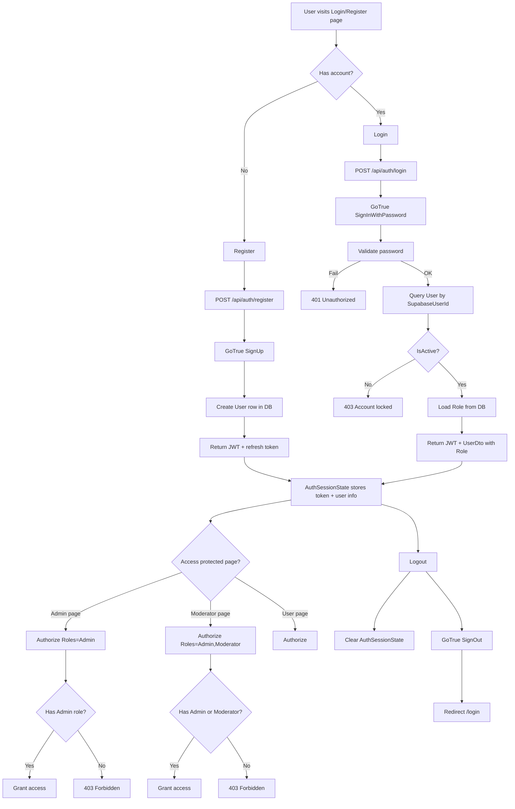
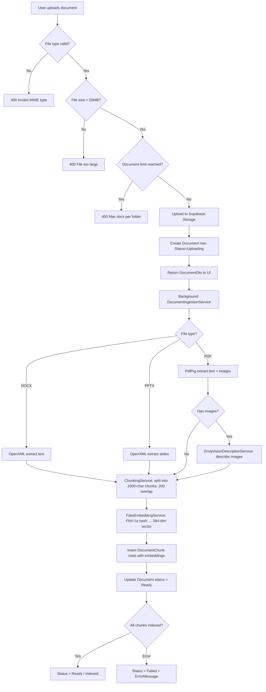
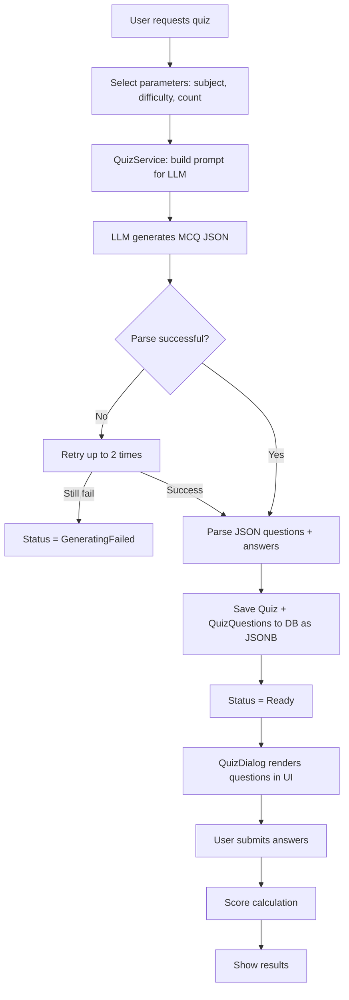
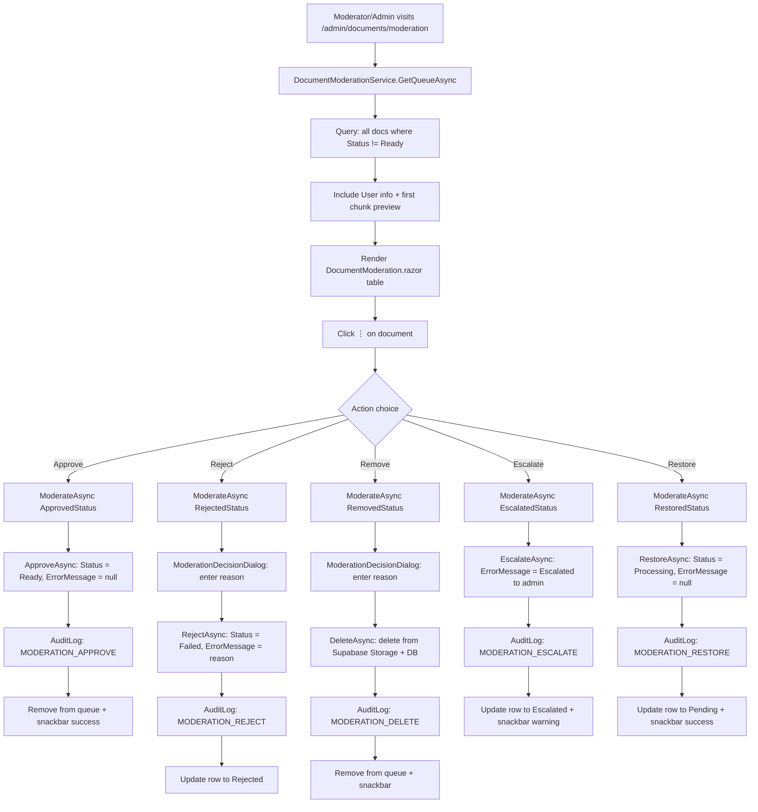
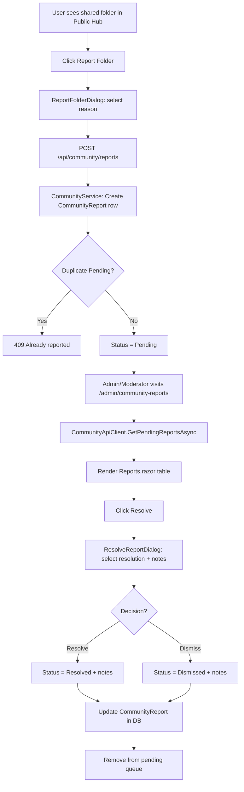
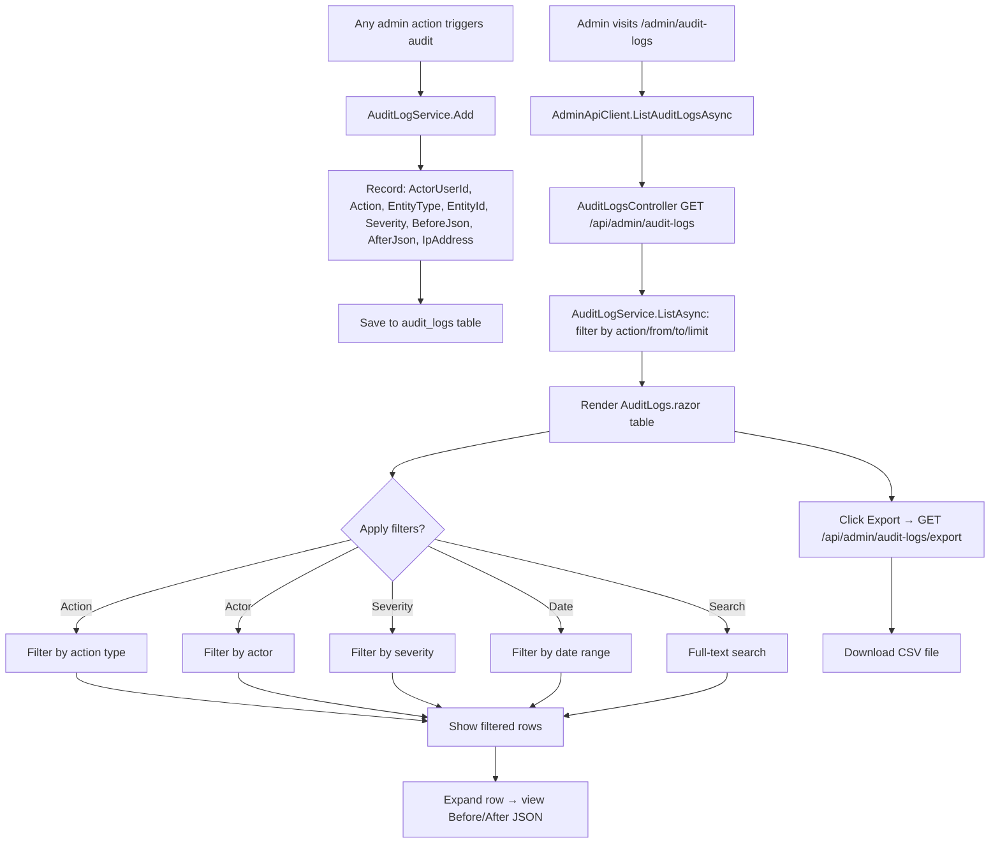
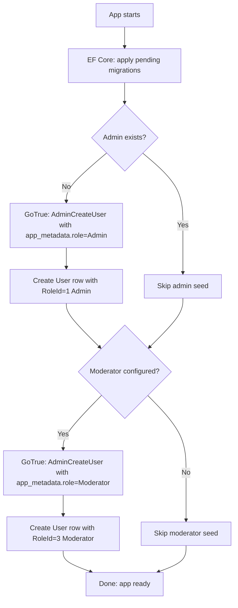
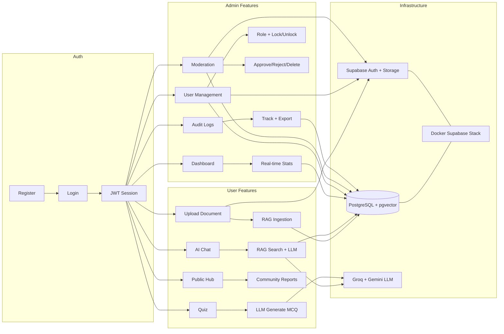

# AI Study Hub v2 — Complete System Workflow

> Generated from codebase analysis 2026-06-30

---

## 1. Authentication Flow



---

## 2. Document Upload & Ingestion Flow (RAG Pipeline)



---

## 3. AI Chat & RAG Query Flow

```mermaid
flowchart TD
    A[User enters question in AiChat page] --> B[ChatPersistenceService: save user message]
    B --> C[RagSearchService: pgvector cosine search]
    C --> D[topK=5 chunks from vector DB]
    
    D --> E[Build system prompt with citations]
    E --> F[Format: [S1]chunk1 [S2]chunk2 ...]
    F --> G[Add chat history to context]
    
    G --> H{ChatCompletionClientFactory}
    H --> H1{AiModel selection}
    H1 -->|gemini-*| H2[GeminiChatCompletionClient → Gemini 2.5 Flash]
    H1 -->|default| H3[GroqChatCompletionClient → Llama 3.3 70B]
    
    H2 --> I[Stream response to UI]
    H3 --> I
    
    I --> J[ChatPersistenceService: save assistant message]
    J --> K[Update AI quota for user]
    K --> L[Return complete chat exchange]
```

---

## 4. Quiz Generation Flow



---

## 5. Admin — Role & Permission Flow

```mermaid
flowchart TD
    A[Admin visits /admin/users] --> B[AdminApiClient.ListUsersAsync]
    B --> C[AdminUsersController.List]
    C --> D[AdminUserService.ListAsync: query all users + roles + doc counts]
    D --> E[Render Users.razor table]
    
    E --> F[Click ⋮ → Change role]
    F --> G[EntitySheet: show assignable roles]
    G --> G1{User is self?}
    G1 -->|Yes| G2[No Change role option]
    G1 -->|No| G3{User is Admin?}
    G3 -->|Yes| G4[No Change role option]
    G3 -->|No| H[Show Moderator/Student dropdown]
    
    H --> I[Select role → SaveRoleAsync]
    I --> J[AdminApiClient.UpdateRoleAsync]
    J --> K[AdminUsersController.PATCH /api/admin/users/{id}/role]
    K --> L[AdminUserService.UpdateRoleAsync]
    
    L --> M{Validate permissions}
    M -->|Own role| M1[400 cannot_change_own_role]
    M -->|Admin role| M2[403 cannot_change_admin_role]
    M -->|Not admin| M3[403 admin_required]
    M -->|OK| N[Update RoleId in DB]
    
    N --> O[GoTrue: AdminUpdateUserById app_metadata.role]
    O --> P[GoTrue: AdminSignOutUser force logout]
    P --> Q[AuditLog: ROLE_CHANGE with before/after]
    Q --> R[Return updated AdminUserDto]
    R --> S[Snackbar success + refresh UI]
```

---

## 6. Admin — User Lock/Unlock Flow

```mermaid
flowchart TD
    A[Admin visits /admin/users] --> B[Click Active/Inactive chip]
    
    B --> C{Currently Active?}
    C -->|Yes| D[ToggleActiveAsync: deactivate]
    C -->|No| E[ToggleActiveAsync: activate directly]
    
    D --> D1{Is current admin?}
    D1 -->|Yes| D2[Snackbar: cannot deactivate self]
    D1 -->|No| D3[Show confirm dialog]
    D3 --> D4[User confirms]
    D4 --> F[AdminApiClient.ToggleActiveAsync activate=false]
    
    E --> F
    
    F --> G[AdminUsersController.PATCH /api/admin/users/{id}/deactivate]
    G --> H[AdminUserService.ToggleActiveAsync]
    
    H --> I{Is self?}
    I -->|Yes| I1[400 cannot_toggle_self]
    I -->|No| J{Already correct state?}
    J -->|Yes| J1[Return unchanged]
    J -->|No| K[Set IsActive = false/true]
    
    K --> L{Deactivating?}
    L -->|Yes| L1[GoTrue: AdminUpdateUserById banned=true]
    L1 --> L2[GoTrue: AdminSignOutUser force logout]
    L -->|No| L3[GoTrue: AdminUpdateUserById banned=false]
    
    L2 --> M[AuditLog: USER_LOCK with before/after]
    L3 --> M[AuditLog: USER_UNLOCK with before/after]
    M --> N[Return updated AdminUserDto]
    N --> O[Snackbar success]
```

---

## 7. Content Moderation Flow



---

## 8. Community Reports Flow



---

## 9. Admin Dashboard Flow

```mermaid
flowchart TD
    A[Admin visits /admin/dashboard] --> B[AdminDashboardApiClient.GetAdminStatsAsync]
    B --> C[DashboardController GET /api/dashboard/admin/stats]
    C --> D[DashboardService.GetAdminStatsAsync]
    D --> D1[SELECT COUNT(*) FROM users]
    D --> D2[SELECT COUNT(*) FROM documents]
    D --> D3[SELECT COUNT(*) WHERE status=uploading/processing]
    D --> D4[SELECT COUNT(*) WHERE status=failed]
    D --> E[Return AdminDashboardStatsDto]
    
    E --> F[Render KPI cards: Users, Docs, Jobs, Failed, Storage]
    
    F --> G[LoadTrendsAsync period=day]
    G --> H[DashboardController GET /api/dashboard/admin/activity-trends?period=day]
    H --> I[DashboardService.GetActivityTrendsAsync]
    I --> I1[Query docs by date buckets last 7 days]
    I --> I2[Query failed docs by date buckets]
    I --> J[Return ActivityTrendsDto with Points]
    J --> K[Render MudChart Line chart]
    
    K --> L{User clicks Week/Month chip?}
    L -->|Yes| G
    L -->|No| M[Done]
```

---

## 10. Audit Log Flow



---

## 11. Database Seed Flow (Startup)



---

## 12. Complete System Overview



---

## Actions Catalog

| Action | Source | Entity | Severity |
|--------|--------|--------|----------|
| `QUOTA_UPDATE` | AdminUserService | users | Medium |
| `ROLE_CHANGE` | AdminUserService | users | High |
| `USER_LOCK` | AdminUserService | users | High |
| `USER_UNLOCK` | AdminUserService | users | High |
| `MODERATION_APPROVE` | DocumentModerationController | documents | Medium |
| `MODERATION_REJECT` | DocumentModerationController | documents | Medium |
| `MODERATION_DELETE` | DocumentModerationController | documents | High |
| `MODERATION_ESCALATE` | DocumentModerationController | documents | High |
| `MODERATION_RESTORE` | DocumentModerationController | documents | Medium |
| `FORCE_LOGOUT_FAILED` | AdminUserService | users | Medium |

---

## Role Hierarchy

```
Admin ──┬── Can manage users (role/lock/quota)
        ├── Can moderate content (approve/reject/delete)
        ├── Can view audit logs
        ├── Can access dashboard
        └── Cannot assign/revoke Admin role
        
Moderator ── Can review community reports
            └── Can moderate documents (escalate to Admin)
            
Student ── Default role
          └── Can upload docs, chat with AI, take quizzes, report folders
```
