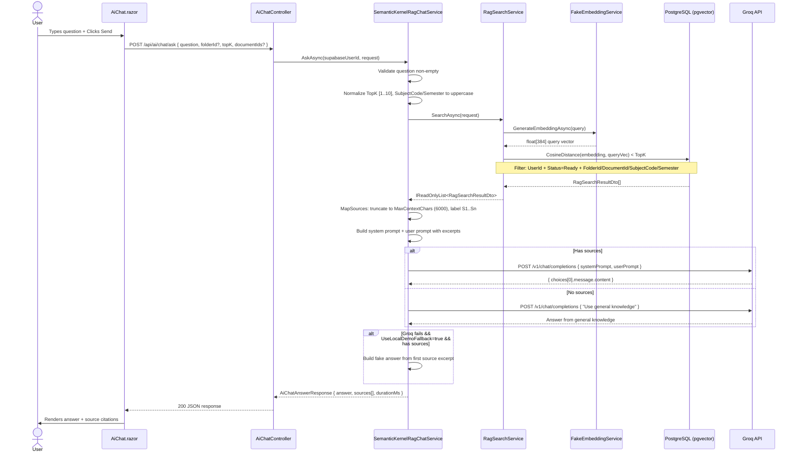
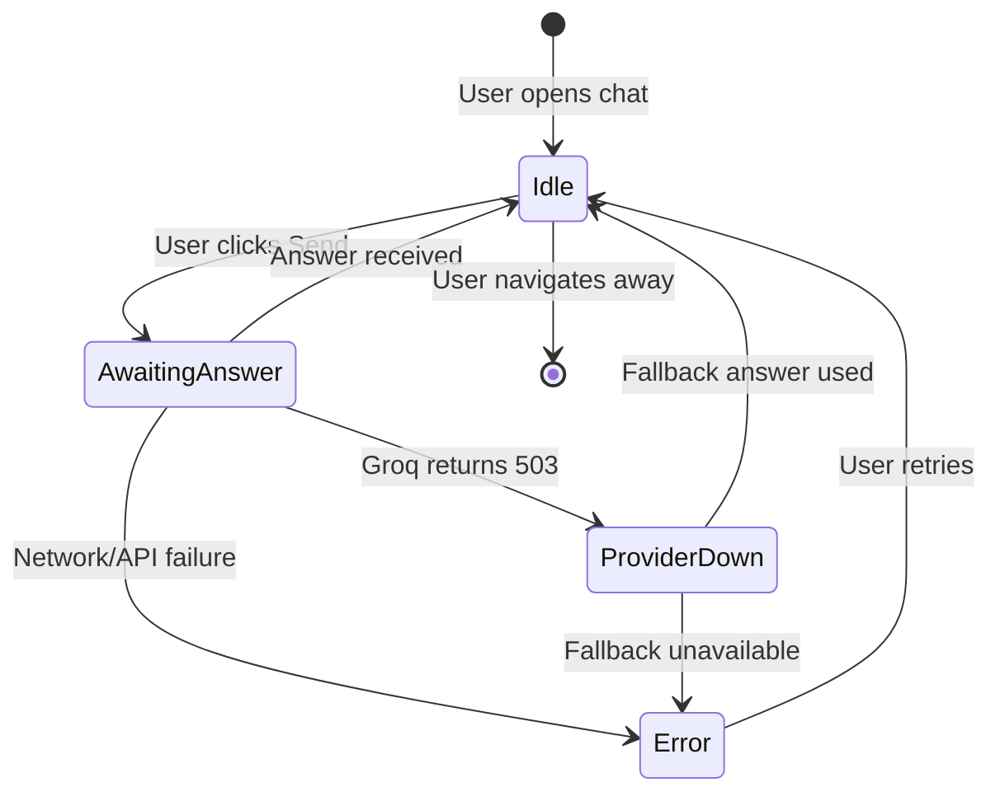
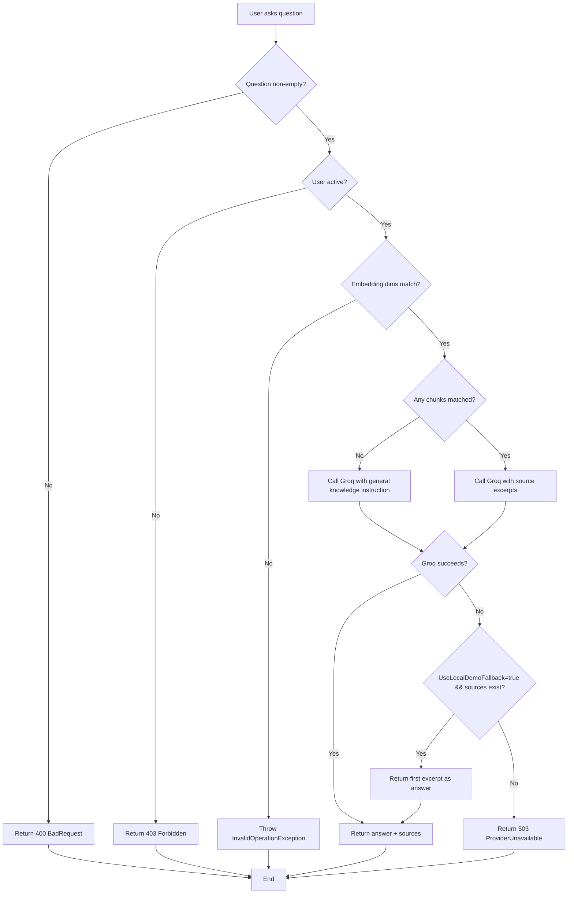
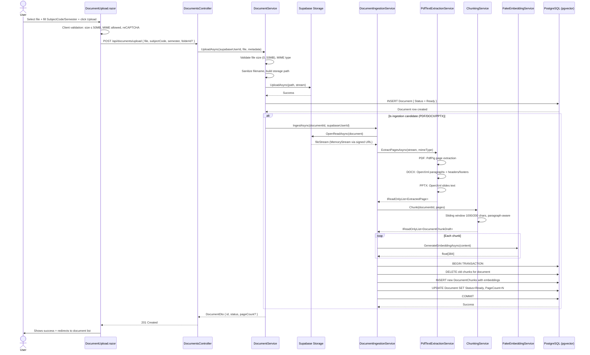
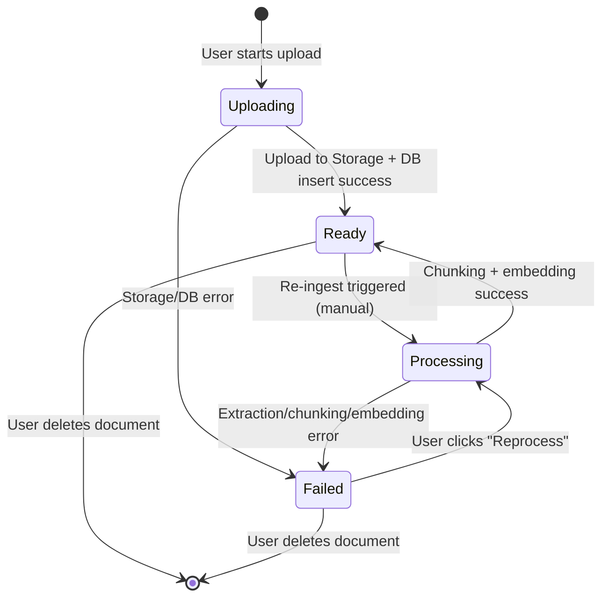
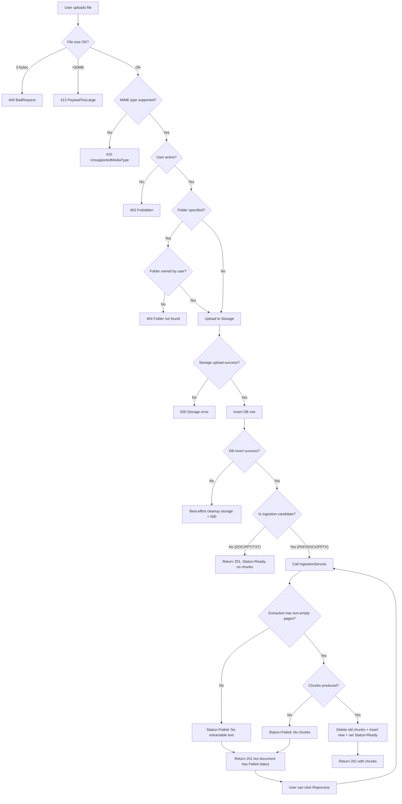
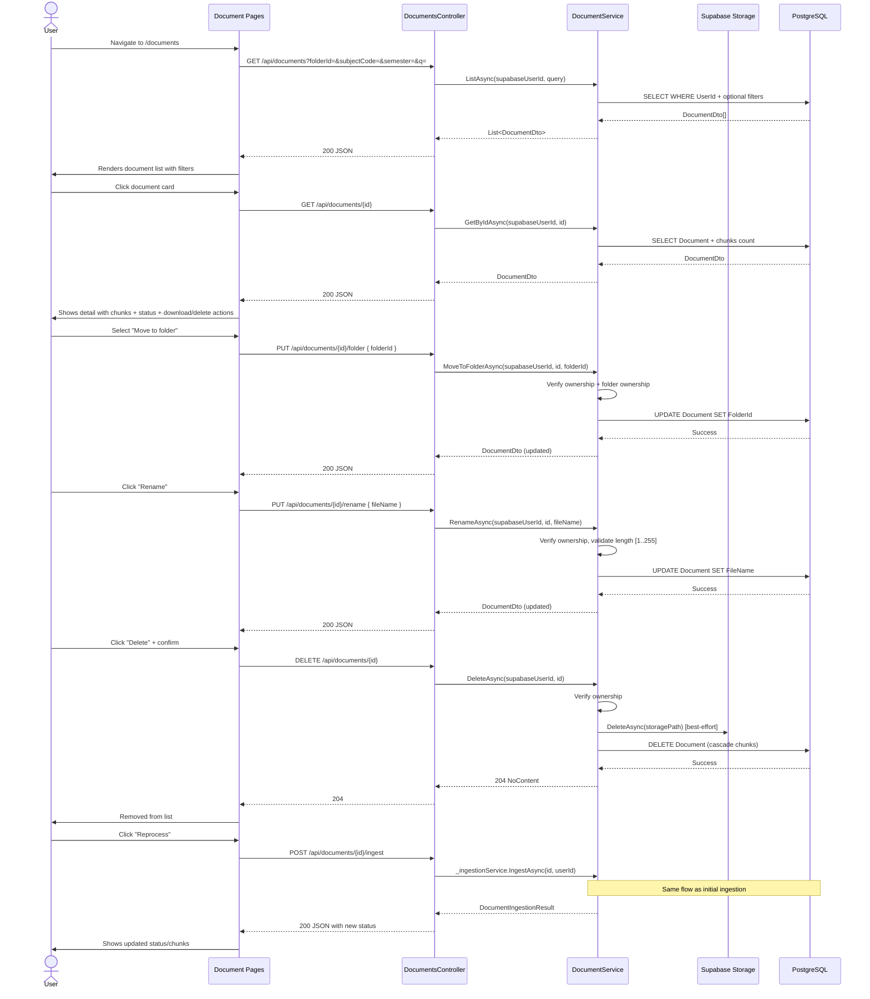

# Workflow Diagrams: AI Question Answering & Document Ingestion

---

## Workflow 1: AI Question Answering (RAG Chat)

### User Flow (Sequence Diagram)



### State Machine (Chat Session & Answer Flow)



### Constraint & Business Specification Table

| # | Constraint / Rule | Value | Enforcement Point | Notes |
|---|---|---|---|---|
| C1 | Max question length | Implicit (no hard limit) | `SemanticKernelRagChatService:44` | Empty question → 400 |
| C2 | TopK range | `[1, 10]` | `SemanticKernelRagChatService:54-55` | Default 5, clamped |
| C3 | Context budget for sources | 6000 chars total | `SemanticKernelRagChatService:76-86` | Truncated per-source |
| C4 | Embedding dimension | 384 | `RagSearchService:36` | Mismatch = InvalidOperationException |
| C5 | Auth requirement | JWT Bearer token | `DocumentsController`, `AiChatController` | Missing/invalid → 401 |
| C6 | User must be active | `User.IsActive == true` | `RagSearchService:48` | Inactive → 403 |
| C7 | Document ownership scoping | `Document.UserId == caller` | `RagSearchService:120-157` | Always enforced |
| C8 | Groq model | `llama-3.1-8b-instant` | `GroqOptions:9` | Configurable |
| C9 | Groq temperature | 0.2 | `GroqOptions:13` | Configurable |
| C10 | Groq max tokens | 1024 | `GroqOptions:15` | Configurable |
| C11 | Groq timeout | 2 minutes | `Program.cs:156` | HttpClient level |
| C12 | Demo fallback | `UseLocalDemoFallback` flag | `GroqOptions:20` | Only if flag + sources exist |
| C13 | Source excerpt truncation | 500 chars per excerpt | `RagSearchService:69` | Then further limited by budget |
| C14 | Document filter chain | `UserId` → `Status=Ready` → `DocumentId/DocumentIds` → `FolderId` → `SubjectCode/Semester` | `RagSearchService:120-157` | Priority order |
| C15 | Search result scoring | `1 - cosineDistance` | `RagSearchService:134` | Higher = more relevant |
| C16 | Groq unavailable error | 503 `ai_provider_unavailable` | `GroqChatCompletionClient:65` | Or fallback if enabled |
| C17 | Groq API key validation | Must be configured | `GroqChatCompletionClient:42` | Startup validation |
| C18 | SubjectCode normalization | Uppercased | `SemanticKernelRagChatService:57-58` | Case-insensitive match |
| C19 | Semester normalization | Uppercased | `SemanticKernelRagChatService:59-60` | Case-insensitive match |

### Branching Conditions (Decision Tree)



---

## Workflow 2: Upload Source Ingestion / Knowledge Source Management

### User Flow (Sequence Diagram)



### State Machine (Document Lifecycle)



### Constraint & Business Specification Table

| # | Constraint / Rule | Value | Enforcement Point | Notes |
|---|---|---|---|---|
| C1 | Max file size | 50 MB (52,428,800 bytes) | `DocumentsController:22`, `DocumentService:20` | 413 if exceeded |
| C2 | Min file size | > 0 bytes | `DocumentService:76` | 400 if empty |
| C3 | Allowed MIME types (upload) | PDF, DOCX, PPTX, DOC, PPT | `DocumentService:28-35` | 415 if unsupported |
| C4 | Ingestion candidates (chunked) | PDF, DOCX, PPTX only | `DocumentService:476-482` | Legacy DOC/PPT skipped |
| C5 | Filename sanitization | `[a-zA-Z0-9._-]`, max 80 chars | `DocumentService:515` | Used in storage path |
| C6 | Display filename max length | 255 chars | `DocumentService:333` | For rename |
| C7 | SubjectCode regex | `^[A-Z]{2,4}\d{3,4}$` | `DocumentUpload.razor` + backend | Client + server |
| C8 | Semester regex | `^(SPR\|SU\|FA\|M1)\d{2}$` | `DocumentUpload.razor` + backend | Client + server |
| C9 | Max files per upload batch | 50 | `DocumentUpload.razor:550` | Client-side only |
| C10 | Chunk size | 1000 chars | `RagOptions:7`, `ChunkingService` | Configurable |
| C11 | Chunk overlap | 200 chars | `RagOptions:9`, `ChunkingService` | Configurable |
| C12 | Embedding dimension | 384 | `RagSearchService:36`, `DocumentChunk:13` | Fixed in migration |
| C13 | Token estimate formula | `ceil(content.Length / 4)` | `DocumentIngestionService:158` | Rough estimate |
| C14 | Error message max length | 1000 chars | `DocumentIngestionService:12` | Trimmed if longer |
| C15 | Signed URL TTL | 300 seconds (5 min) | `DocumentService:23` | For download + ingestion |
| C16 | Storage path pattern | `users/{userId:N}/{yyyy}/{docId:N}-{slug}` | `DocumentService:127` | Year-based partitioning |
| C17 | Ownership verification | Every endpoint | `DocumentService` throughout | `Document.UserId == callerId` |
| C18 | Folder ownership | Must belong to caller | `DocumentService:102` | If `FolderId` specified |
| C19 | User must be active | `User.IsActive == true` | `DocumentService:72` | 403 if inactive |
| C20 | reCAPTCHA required | In non-Development | `Program.cs:38-43` | Configurable `Recaptcha:Enabled` |
| C21 | Concurrent upload files | Processed sequentially | `DocumentUpload.razor:601-618` | One-by-one, not parallel |
| C22 | MIME fallback | `application/octet-stream` → `.pdf`/`.docx`/`.pptx` extension mapping | `DocumentService:420-440` | Browser MIME sniffing workaround |
| C23 | Request size limits | 50 MB ASP.NET limit | `DocumentsController:22` | `RequestSizeLimit` + `RequestFormLimits` |
| C24 | Max storage path components | `users/{userId}/{year}/{docId}-{slug}` | `DocumentService:127-130` | 4 segments |
| C25 | DB cleanup on storage failure | Storage uploaded but DB insert failed → delete storage object best-effort | `DocumentService:155-170` | No rollback |

### Branching Conditions (Decision Tree)



### Knowledge Source Management Sub-Workflows



### Constraint Violation Error Codes

```mermaid
flowchart LR
    subgraph Upload Errors
        A[400] --> A1[Empty file]
        B[413] --> B1[File >50MB]
        C[415] --> C1[Unsupported MIME type]
        D[401] --> D1[Missing/invalid JWT]
        E[403] --> E1[User inactive]
        F[404] --> F1[Folder not found]
        G[500] --> G1[Storage/DB error]
    end
    
    subgraph Management Errors
        H[404] --> H1[Document not found]
        I[403] --> I1[Not document owner]
        J[400] --> J1[Invalid rename (empty/too long)]
        K[204] --> K1[Delete success (no body)]
    end
```

---

## Implementation Notes

### Workflow 1 — AI QA Key Integration Points
- All search + QA logic is **synchronous** (request thread blocks on Groq API call)
- Chat history is **in-memory only** (`AiChatSessionState`) — lost on page refresh
- No per-user rate limiting (relies on Groq's free-tier 30 req/min)
- Source citation labels (`S1`, `S2`, ...) are sequential, not document-based

### Workflow 2 — Ingestion Key Integration Points
- Ingestion is **synchronous inline** — large documents block upload response
- No background job queue yet (planned Phase 3/4)
- 0 non-empty pages → not a soft error; it throws → document goes to `Failed` status
- Legacy DOC/PPT are accepted for upload but **not ingested** (no chunks created)
- Re-ingest replaces all chunks atomically (DB transaction)
- Storage object is NOT deleted on re-ingest — only chunks are replaced
- Signed URLs expire in 5 minutes — ingestion must complete within that window
